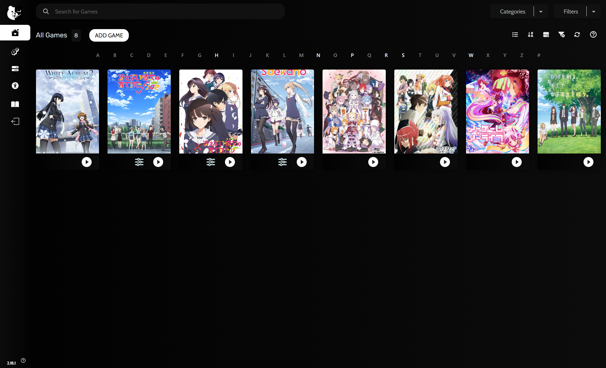

# AniEXE

**Offline local anime launcher for your existing game launcher.**

AniEXE is a small Windows executable (compiled from C++) that turns an anime folder into something a **game launcher** (Steam, Heroic, Playnite, etc.) can launch and track - **right alongside your games and visual novels**.

No servers.  
No database.  
No scraping.  

Just folders and playback.

---

## What it does

When you run **AniEXE.exe**:

1. Scans the folder it lives in
2. Finds supported video files
3. Filters out samples / trailers / extras
4. Sorts episodes using *natural sorting* (01, 02, 10 - not 1, 10, 2)
5. Generates a temporary playlist
6. Launches it with **mpv / mpv.net**
7. Cleans up and exits

Your launcher:
- Tracks playtime
- Shows artwork
- Remembers last played

mpv / mpv.net:
- Handles resume
- Starts exactly where you left off
- Proper subtitle rendering (ASS, timing, styling)
- Chapter / OP / ED markers for quick skipping

---

## Recommended folder layout

Each **season** is one launcher entry.

Anime/

└─ Anime_Name/

└─ Season 1/

├─ AniEXE.exe

├─ cover.png (for your launcher)

├─ EP01.mkv

├─ EP02.mkv

└─ EP03.mkv


Why per season?
- Launchers track playtime per entry
- Seasons usually have different cover art
- Cleaner progress tracking

If an anime has only one season, one folder is enough.

---

## Requirements

### 1. mpv.net (required)

AniEXE uses **mpv.net** for playback, resume, and ordered episodes.

Install via **winget**:

```powershell

winget install mpv.net

```
How to install with **winget**:

**1.** Press **Win + X**

**2.** Select **Terminal**

**3.** Paste the command above and press Enter

**4.** Wait for installation to finish

# Game launcher (recommended)

AniEXE works standalone, but it is designed to be used with a launcher.

You can use **any** launcher that supports custom executables.

**Recommended: Heroic Games Launcher**
```powershell 

winget install HeroicGamesLauncher.HeroicGamesLauncher

```
Heroic is recommended because it:

- Supports custom executables

- Tracks playtime and last played

- Allows full UI theming and CSS customization

# Setup

**1.** Place **AniEXE.exe** inside the anime season folder

**2.** Open your game launcher

**3.** Click **Add Game** (or equivalent)

**4.** Set the executable to `AniEXE.exe`

**5.** Add cover art if your launcher supports it

**Tip:**
Create a category like Anime (or genres like Romance, Mystery, etc.) to keep anime entries separate from games.



*What this is not*

- A media server

- A scraper

- A library manager

**Enjoy your Anime library**!

## Attribution

The AniEXE application icon artwork was created by **@TEIGI_3**.

I do not claim ownership of this artwork.
All rights belong to the original artist.
If the artist would like this icon removed or replaced, please open an issue.

